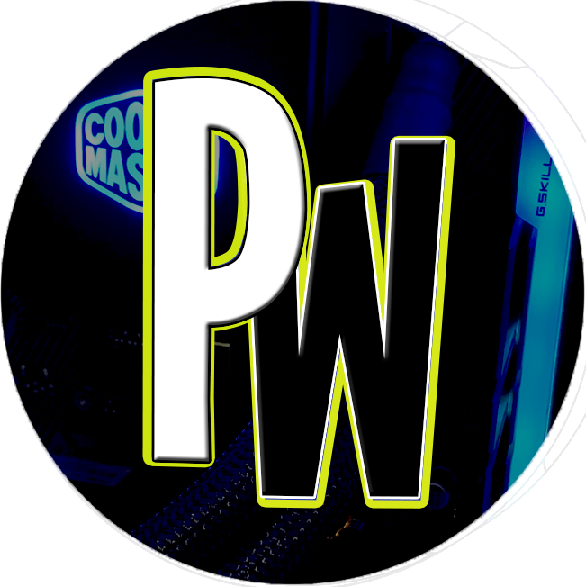

# 🌟 PW-Studios

  

Welcome to **PW-Studios** — a creative dev space led by [Juan Rodriguez](https://github.com/ProgrammingW), focused on building **video games**, **web applications**, and **experimental software**. This is where code meets creativity.

---

## 🎮 What We Do

At PW-Studios, we're all about crafting engaging digital experiences through code. Our main focuses:

- **🎯 Game Development**  
  2D and 3D games using Unity, Unreal, and custom engines. Expect post-apocalyptic worlds, unique gameplay mechanics, and deep storytelling.

- **🌐 Web Applications**  
  From dynamic dashboards to full-stack solutions. Built with Vue, React, Node.js, Express, PHP, and more.

- **🧪 Experimental Projects**  
  Tools, prototypes, and utilities made just for fun or to test cool ideas.

---

## 🚧 Projects in Progress

> Check our pinned repositories for the latest builds and code drops. Some of our active or upcoming work includes:

- **Main Game**: A post-apocalyptic action RPG with anthropomorphic creatures and rideable mounts.  
- **PW Launcher**: A desktop launcher that manages all your PW games and updates.  
- **Landing Page**: Studio showcase website, tech stack roadmap, and dev blog.

---

## 🛠️ Tech Stack Highlights

- Unity • C# • Unreal Engine • Blender  
- JavaScript • Vue • React • Angular • Node.js  
- Python • Java • PHP • Firebase • MongoDB  
- Docker • Git • CI/CD Pipelines

---

## 📬 Contact & Collaborations

We’re always down to chat with other devs, designers, and gamers.  
Feel free to open issues, submit pull requests, or reach out for collabs.

- 💌 [davidjuan152@gmail.com]  
- 🌐 [programmingw.com]

---

## ⭐ Support the Studio

If you like what we’re building, show some love:

- Follow this org  
- Star our repos  
- Share our games or tools

Let’s build dope things together.

---

**PW-Studios** — *Coding the future, one pixel at a time.*
